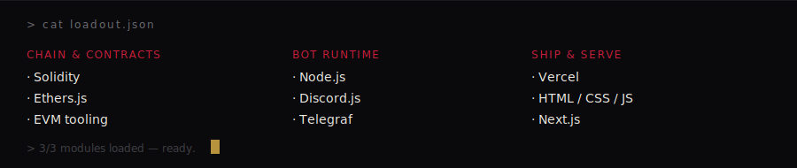
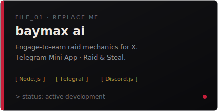
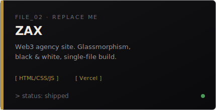

 

## &gt; whoami

I'm **Peyman**  building under the name **Hopcofficial**. Web3 content creator and Discord/Telegram bot developer, vibe coder.
ship self contained tools without a build step, and keep everything I make dark, cinematic, and a little dramatic.

- 🎯 Currently building a content-automation system: Telegram bot + web dashboard with a Claude powered brand voice
- 🛠️ Shipping Web3 tooling  raid mechanics, bots, and mini apps
- 🌐 Fluent in English, Turkish, and Farsi
- 🖤 One rule across every project: no build step, no compromise on aesthetic

## &gt; loadout

## &gt; active_files

<table>
<tr>
<td width="50%"></td>
<td width="50%"></td>
</tr>
</table>

## &gt; stats

## > contact

